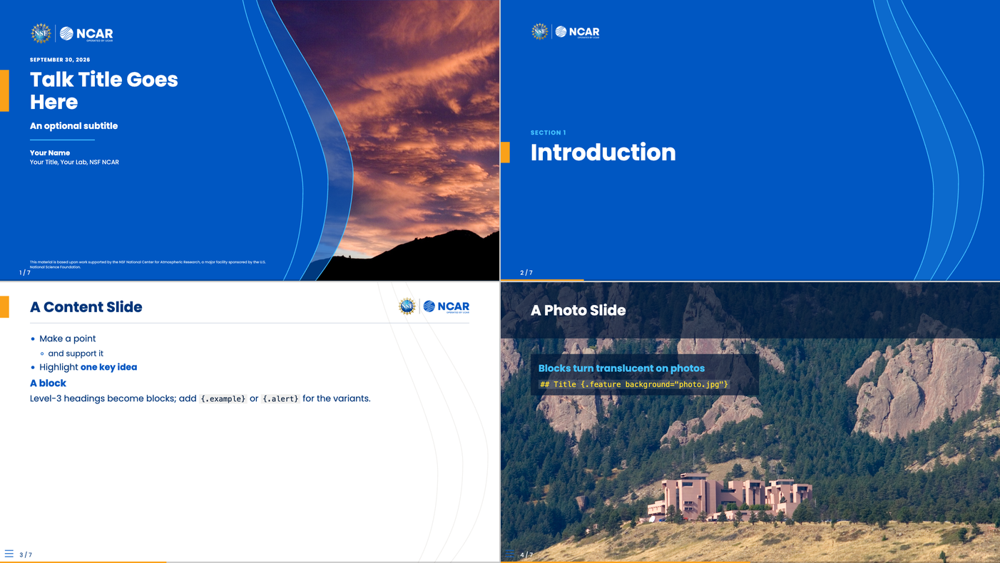
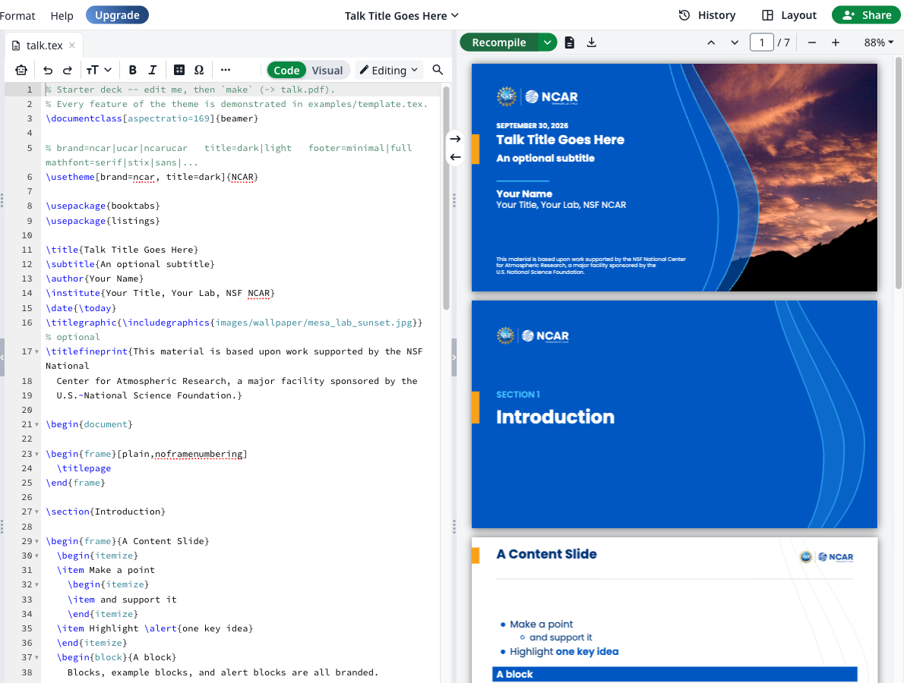
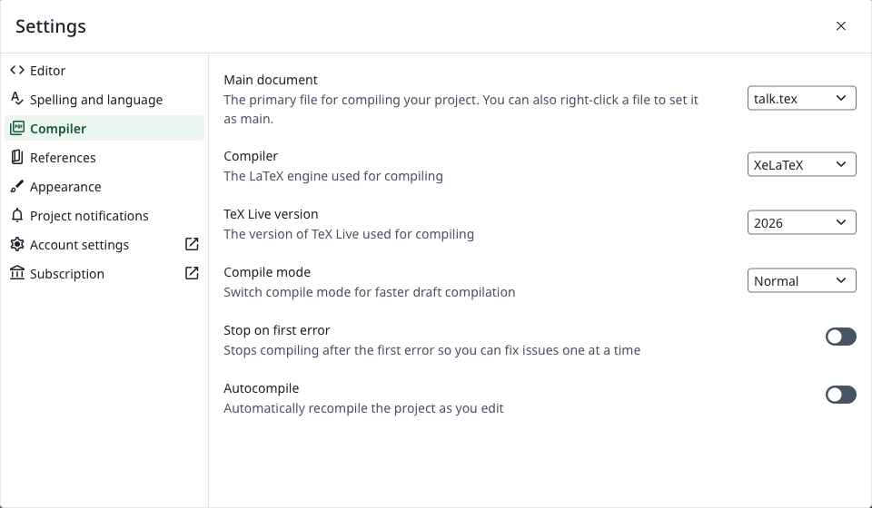
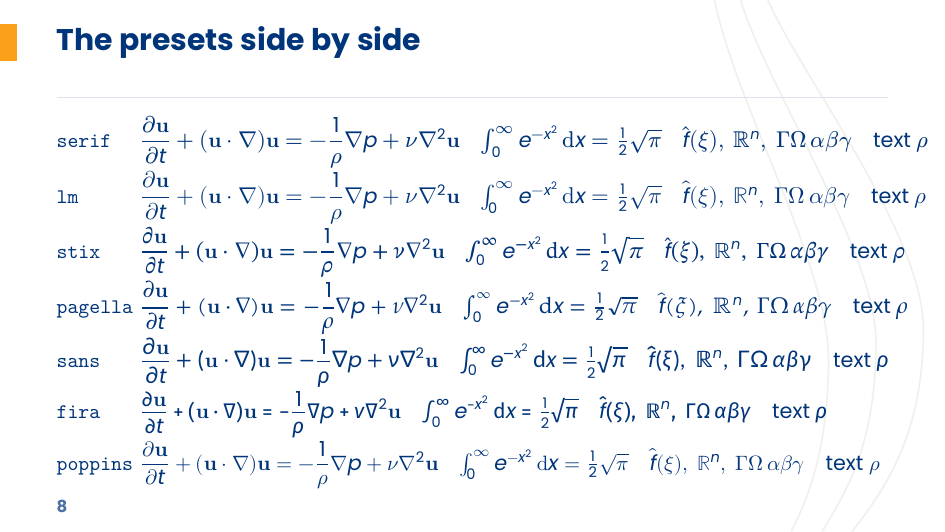

# NSF NCAR / UCAR Beamer Template

Branded slides for NSF NCAR, UCAR and UCP, written in **LaTeX beamer** or
**Quarto Markdown**: a PDF, and from the same Markdown an **HTML** (revealjs)
deck to present in a browser. The theme follows the 2026 Brand Guide: the
brand palette, Poppins type, the official logo lockups, and the wave
super-graphic.




## Quick Start

### 1. Get your own copy

Click **Use this template → Create a new repository** at the top of this
page. Or, from the command line:

```bash
gh repo create my-talk --template benkirk/NCAR_beamer_template --private --clone
cd my-talk
```

### 2. Install the prerequisites

| you want | you need |
|---|---|
| LaTeX slides | TeX Live (or MacTeX / MiKTeX) with **XeLaTeX** and **latexmk**; or nothing, on [Overleaf](#overleaf) |
| Quarto HTML slides | [Quarto](https://quarto.org/docs/get-started/) ≥ 1.6 only: no TeX |
| Quarto PDF slides | the LaTeX row, plus [Quarto](https://quarto.org/docs/get-started/) ≥ 1.6. Quarto's TinyTeX (`quarto install tinytex`) also works and installs missing LaTeX packages on the fly. With a minimal TeX Live, callouts need `fontawesome5` (`texlive-fonts-extra` on Debian/Ubuntu). |

On NCAR systems, `module load texlive` provides TeX. No font installation is
needed, because Poppins is bundled with the theme.

### 3. Write and build

| | edit | build | output |
|---|---|---|---|
| **LaTeX** | `talk.tex` | `make` | `talk.pdf` |
| **Quarto** | `talk-quarto.qmd` | `make quarto` | `talk-quarto.pdf` |
| **Quarto, HTML** | `talk-quarto.qmd` | `make html` | `talk-quarto.html` (+ `talk-quarto_files/`) |

Both starter decks contain a title slide, a section divider, a content slide,
a photo slide, code, and a closing slide. Replace the placeholder text, drop
your photos into `images/`, and rebuild.

Stuck? `examples/` shows every feature: [`template.tex`](examples/template.tex),
[`quarto-demo.qmd`](examples/quarto-demo.qmd), and
[`paper.tex`](examples/paper.tex) for non-slide documents. Build them with
`make examples`.

### Overleaf

No TeX to install: open the LaTeX starter deck as a new Overleaf project, with
the compiler already set to XeLaTeX:

[**Open in Overleaf**](https://www.overleaf.com/docs?snip_uri=https://github.com/benkirk/NCAR_beamer_template/releases/latest/download/ncar-beamer-overleaf.zip&engine=xelatex)

Or by hand: download `ncar-beamer-overleaf.zip` from the
[latest release](https://github.com/benkirk/NCAR_beamer_template/releases/latest),
**New Project → Upload Project**, then **Settings → Compiler → XeLaTeX**
(under pdfLaTeX the deck still builds, but in Helvetica with Computer Modern
math: the theme's pdfLaTeX fallback) and **Recompile**.





The project is `talk.tex`, its photos, the theme in `_extensions/ncar/`, and a
`latexmkrc` at the root that points TeX at the theme (Overleaf reads it; it is
the only way to set `TEXINPUTS` there). Poppins comes bundled, so it works on
the free plan's compile time limit. Quarto decks stay local: Overleaf has no
Quarto.

## Already have a project?

**A Quarto project:** add the extension to it, then use `format: ncar-beamer`
(PDF) or `format: ncar-revealjs` (HTML), or list both:

```bash
quarto add benkirk/NCAR_beamer_template
```

**An existing LaTeX deck:** point TeX at the theme directory and switch the
theme:

```bash
export TEXINPUTS=/path/to/NCAR_beamer_template/_extensions/ncar//:
export TTFONTS=/path/to/NCAR_beamer_template/_extensions/ncar//:   # bundled Poppins
latexmk -xelatex my-talk.tex
```

```latex
\usetheme[brand=ncar]{NCAR}
```

**An existing Overleaf project:** upload the `_extensions/ncar` folder from the
release zip (the `.sty` files, `ncar-assets/fonts/`, `ncar-assets/logos/`) and
the zip's `latexmkrc` at the project root, then `\usetheme[...]{NCAR}` and set
the compiler to XeLaTeX.

## Cheat sheet

| | LaTeX | Quarto Markdown |
|---|---|---|
| Title slide | `\titlepage` in a `[plain]` frame | automatic from `title:`, `subtitle:`, `author:`, `institute:`, `date:` |
| Photo on the title slide | `\titlegraphic{\includegraphics{photo.jpg}}` | `titlegraphic: photo.jpg` |
| Fine print under the title | `\titlefineprint{...}` | `fineprint: "..."` |
| Section divider | `\section{...}` | `# Section` |
| Divider subtitle | `\sectionsubtitle{...}` before `\section` | a paragraph right after `# Section` |
| Slide | `\begin{frame}{Title}` | `## Title` |
| Blocks | `block`, `exampleblock`, `alertblock` | `### Title`, `### Title {.example}`, `### Title {.alert}` |
| Emphasis | `\alert{...}` | `[text]{.alert}` |
| Slide footnote (an aside at the foot, under a short rule) | `\ncarfootnotespring` first and before `\begin{ncarfootnotes}\ncarfootnote{†}{...}\end{ncarfootnotes}` | a paragraph that starts with `†` or `‡`, anywhere on a content slide |
| Photo "feature" slide | `\begin{frame}[ncarbg=photo.jpg]` | `## Title {.feature background="photo.jpg"}` |
| Closing slide | `\ncarclosingframe{Thank you!}{...}` | `## Thank you! {.closing}` |
| Center or scale a short slide's body | `\begin{frame}[c]`, `\fontsize` | `## Title {.center scale="1.4"}` (below) |
| Code | `lstlisting` (styled automatically) | fenced code blocks (brand-colored highlighting) |
| Callouts | | `::: {.callout-note}` and the other callout types |
| Extra logo or slide decoration | `\logo{...}`: bottom right, above the footer (space reserved) | `logo: file.png` |
| Theme options | `\usetheme[<options>]{NCAR}` | `themeoptions: [<options>]` |
| Math font | `\usetheme[mathfont=stix]{NCAR}` | `themeoptions: [mathfont=stix]` |

Everything in the Quarto column works in both `ncar-beamer` and `ncar-revealjs`.
The HTML format adds a few things of its own (next section).

**Slide footnotes.** A paragraph that starts with `†` (or `‡`) is an aside, not
body text. Every one on a content slide (not a feature or closing slide),
including one inside a column, moves to the slide's foot in the order written. There they stack under one short rule, in
small muted type, with the marker hanging in the accent color. In HTML the
autofit keeps the body above them; in the PDF two `filll` springs keep the body
centered above and stand the footnotes on the floor. (pptx output can't move
content, so a post-render step only mutes them in place; see
quarto-docs-framework's `style_footnotes.py`.)

**Layout of a short slide.** Five per-slide controls, each independent, act on
the body: everything but the title, speaker notes and footnotes.

| Control | Effect | HTML | PDF |
|---|---|---|---|
| `.hcenter` | centers the body across as a block; its text stays left-aligned | yes | prose, lists and code; a table or captioned figure already centers; with one of those or columns, nothing |
| `.vcenter` | centers the body between the title rule and the floor | yes | frame option `c` |
| `.center` | both (not Quarto's `.center`, which moves the title too) | yes | as above |
| `scale="S"` | sizes text, tables and code by S (0.8 shrinks) | yes; autofit still shrinks an overshoot | a `\fontsize` group; no autofit, so check the page |
| `.fill` | grows the body until it just fits, up to 3× | yes | nothing (LaTeX can't measure it); add `scale=` for the PDF |

```markdown
## Who's still on legacy {.center scale="1.4"}
## A short script {.hcenter .fill}
```

Images keep their own sizes. Highlighted code keeps its full-width shading in
the PDF, so `.hcenter` shows there only on plain code blocks.

## HTML slides (`ncar-revealjs`)

The same Markdown renders as a [revealjs](https://revealjs.com) web deck, in the
same layouts: the title slide with waves or a photo, section dividers,
content slides with the accent tab and logo, feature and closing slides.

```bash
quarto render talk-quarto.qmd --to ncar-revealjs    # or: make html
```

Open `talk-quarto.html` in a browser; keep `talk-quarto_files/` beside it.

| key | |
|---|---|
| `→` `←` / space | next / previous |
| `f` | full screen |
| `s` | speaker view: notes (`::: {.notes}`), next slide, timer |
| `m` | slide menu |
| `b` / `c` | whiteboard / draw on the slide |
| `o` / `esc` | overview |

HTML-only extras:
- **`## Title {.brand-dark}`**: a content slide on Space with white text. PDF
  draws an ordinary slide.
- **Autofit**: a content slide that overflows shrinks its body text (down to
  65%) until it fits; the title keeps its size. Opt out per slide with
  `{.no-autofit}` or `{.scrollable}`, or per deck with `themeoptions: [autofit=false]`.
- **Live diagrams**: mermaid and Graphviz draw in the browser, filling the
  column (capped to the content height). Mermaid picks up the brand font and
  colors. `examples/quarto-demo.qmd` has one of each.
- **Screenshots**: `{height="72%" fig-align="center"}`, the beamer recipe for a
  full-width 16:9 image, fits the HTML slide too. A smaller percentage gives
  a proportionally smaller image.
- **Fragments**: `::: {.incremental}` lists and `. . .` pauses step through.
  (Beamer PDF gets one page per step.)

**One file to email:** set `embed-resources: true` for a single self-contained
`.html` (fonts, logos and photos inlined). The whiteboard can't be embedded,
so turn it off at the same time:

```yaml
format:
  ncar-revealjs:
    embed-resources: true
    chalkboard: false
```

**A PDF from the HTML deck:** open it with `?print-pdf` after the file name
(for example `talk-quarto.html?print-pdf`) in Chrome, and print to PDF with
background graphics on. For a PDF to hand out, the beamer format is usually
the better choice.

### Theme options

| option | values | default | |
|---|---|---|---|
| `brand` | `ncar`, `ucar`, `ncarucar` | `ncar` | palette and logo lockup: NSF NCAR, UCAR, or NSF NCAR-UCAR |
| `title` | `dark`, `light` | `dark` | title/closing slide field: brand color with the white-reversed logo, or white with the full-color logo |
| `fonts` | `poppins`, `bundled`, `helvetica` | `poppins` | `poppins` uses the bundled copy where TeX can find it, else an installed Poppins (probing the system by name is slow on a cold font cache, so the bundled copy comes first); `bundled` always uses the bundled copy; `helvetica` is the brand's sanctioned substitute (and the only choice under pdfLaTeX) |
| `footer` | `minimal`, `full` | `minimal` | page number only, or also the section, short title and date |
| `sectionpages` | `true`, `false` | `true` | a branded divider slide at each section |
| `logo` | `true`, `false` | `true` | logo at the top right of content slides |
| `waves` | `true`, `false` | `true` | the brand's faint wave lines behind content slides |
| `mathfont` | `serif`, `lm`, `stix`, `pagella`, `sans`, `fira`, `poppins`, `keep`, or a font name | `serif` | the math font (next section) |
| `autofit` | `true`, `false` | `true` | HTML only: shrink overflowing content slides to fit |

The HTML format reads `brand`, `title`, `waves` and `autofit` and ignores the
rest. It has no NSF NCAR-UCAR web lockup yet, so `brand=ncarucar` shows the
NSF NCAR logo there.

`make variants` builds `examples/template.tex` in UCAR, NCAR-UCAR, light-title,
4:3, pdfLaTeX and `mathfont=poppins` flavors.

### Math fonts

Poppins has no math. Left to itself, beamer sets the letters of an equation in
Poppins Italic among Computer Modern symbols, which is fine for a variable name
in a sentence and falls apart on anything with fractions or operators. So the
theme sets a serif math font, scaled a little to sit with Poppins' large
x-height, and `mathfont=` picks which:



| `mathfont=` | font | |
|---|---|---|
| `serif` | New Computer Modern Math (Book) | the default; Latin Modern Math where it is not installed |
| `lm` | Latin Modern Math | lighter Computer Modern |
| `stix` | STIX Two Math | Times-like, compact |
| `pagella` | TeX Gyre Pagella Math | Palatino-like |
| `sans` | Lete Sans Math | a complete sans math font (Lato); Fira Math where it is not installed |
| `fira` | Fira Math | humanist sans; no bold or script alphabets |
| `poppins` | Poppins letters, Computer Modern symbols | the look of theme versions before 2.3 |
| `keep` | | leave the document's math setup alone |
| anything else | that OpenType math font, by name or file | for example `mathfont=XITSMath-Regular.otf` |

Under pdfLaTeX `serif` gives Computer Modern math and the other presets fall
back to it. The fonts come with TeX Live (`newcomputermodern`, `stix2-otf`,
`tex-gyre-math`, `lete-sans-math`, `firamath`; Debian and Ubuntu ship Pagella
Math in `fonts-texgyre-math`, not in `texlive-fonts-extra`); a preset whose
font is missing warns and keeps the document's math font.

In Quarto, `themeoptions: [mathfont=stix]` does the same, and Quarto's own
`mathfont:` key still works (the theme then leaves math alone). The HTML deck
is unaffected: MathJax sets its own serif math.

`\ncarmathfont{<preset>}` selects a preset later in the preamble, and
`\ncarmathversion{<version>}{<preset>}` sets one up as a math version to
compare several in one document; `examples/mathfonts.tex` is the specimen
above.

### Colors

Use the palette by name:
- **NSF NCAR:** `NCARBlue`, `DarkBlue`, `Space`, `LightBlue`, `LightGray`
- **UCAR/UCP:** `UCARAqua`, `UCARAquaContrast`, `LightAqua`
- **Accents:** `BrandOrange`, `BrandYellow`

There are also brand-aware roles that follow the `brand=` option: `BrandPrimary`, `BrandPrimaryText`, `BrandSecondary`,
`BrandAccent` and `BrandText`.

## Brand rules the theme follows

- **Text colors:**
  - Dark Blue on white or Light Gray.
  - White on NCAR Blue.
  - Space on UCAR Aqua.
- **Accents:** orange and yellow appear only in small amounts (the title bar, the slide-title tab, alert blocks).
- **Logos:**
  - The NCAR logo is always locked up with the NSF logo.
  - Full-color on light backgrounds, white-reversed on dark ones.
  - Never placed on busy photos, so feature slides have no logo.
- **Fonts:** Poppins Bold for headlines and Poppins Regular for body text, with Helvetica as the substitute.
- **Waves:** the three lines of the brand's cover art, traced from the slide
  template (`tools/fit-waves.py`): the photo title and the content-slide lines
  as on the template, the same curves shifted right on dividers and the
  closing slide. Never more than three, never crossing, never in an accent
  color.

The logos are the official RGB lockups from the UCAR brand portal
(<https://ucar.canto.com/v/branding>). NSF NCAR, UCAR and UCP staff may use
them on presentations without further permission. For any other use, contact
designhelp@ucar.edu. Poppins is distributed under the SIL Open Font License.

## What's in the repository

```
talk.tex, talk-quarto.qmd   your starter decks
latexmkrc                   points latexmk at the theme (Overleaf reads it)
images/                     photos (examples use images/wallpaper/)
_extensions/ncar/           the theme: Quarto extension *and* LaTeX sources
  beamerthemeNCAR.sty         options; loads the color/font/inner/outer themes
  ncar_branding.sty           palette, fonts, logos, listings style (also for non-beamer docs)
  ncar-beamer.lua             Quarto: loads the theme; Markdown sugar
  ncar-revealjs.{scss,css,js,lua}, title-slide.html
                              the HTML (revealjs) format
  ncar.theme                  syntax-highlighting colors
  ncar-assets/                logos and bundled Poppins; web/ holds the HTML logos
tools/web-logos.sh          regenerates ncar-assets/web/ from the brand kit
tools/fit-waves.py          fits the wave curves to the brand's cover art
examples/                   feature showcase (LaTeX, Quarto, article), math font specimen
  diagrams/                   one Graphviz and one mermaid source, shared by both
                              showcases; `make diagrams` rebuilds the PDFs that
                              template.tex includes (needs Graphviz and npx)
```

**Releasing:** bump `version` in `_extensions/ncar/_extension.yml` (and
`VERSION` in `ncar-revealjs.lua`), merge, then tag it: `git tag v2.3.1 && git
push origin v2.3.1`. The `release` workflow builds `make overleaf`'s zip and
publishes a GitHub Release with it, which is what the Overleaf link above
opens; it refuses a tag that does not match the extension version. Quarto users
can pin one: `quarto add benkirk/NCAR_beamer_template@v2.3.1`.

## Migrating a 2020-brand (v1) deck

1. Change `\usetheme{ncar}` to `\usetheme{NCAR}`.
2. Point `TEXINPUTS` and `TTFONTS` at this repo's `_extensions/ncar/` (see
   "Already have a project?" above).

Everything else carries over:
- **Environments:**
  - `NCARtitleframe[img]` becomes the new title slide. Its body, usually
    `\vspace` plus `\maketitle`, is ignored.
  - `NCARprettyframe[img]` becomes a photo feature frame, or a brand-field
    frame when no image is given.
- **Colors:** the old names still compile. `HilightGreen` is now an NCAR Blue
  text highlight, so it stays legible on white.
- **`\logo{...}`** still decorates the bottom of a slide, as before.
- **`listings`** is still loaded automatically, and your own `\lstset`
  still works.
- **No-op commands:** `\titlebackground`, `\nobackground` and
  `\defaultbackground` do nothing.

What looks different:
- Poppins is wider than Helvetica, so slides packed to the limit may need
  trimming or `[shrink]`.
- Each `\section` now gets a divider slide. Use `sectionpages=false` for the
  old behavior.
- `footer=full` shows the section name in the footer, as the old footer did.
- Math is set in a serif math font (since 2.3; `mathfont=poppins` restores
  Poppins letters), and content slides carry the brand's faint wave lines
  (`waves=false` removes them).

## The 2020-brand version

The previous theme (`\usetheme{ncar}`, CoolGray with the older `#1A658F` blue
and Cormorant) is preserved at tag
[`v1.0-brand2020`](https://github.com/benkirk/NCAR_beamer_template/tree/v1.0-brand2020)
and on branch `brand-2020`. Documents that use its color names (`NCARBlue`,
`CoolGray11`, `DeepBlue`, ...) still compile with this version; those names
map onto the nearest 2026 colors.

## License

Copyright © 2026 University Corporation for Atmospheric Research.

This theme is licensed under
[CC BY-SA 4.0](https://creativecommons.org/licenses/by-sa/4.0/) (Creative
Commons Attribution-ShareAlike 4.0 International); the full text is in
[`LICENSE`](LICENSE). You may share and adapt it with attribution, provided
you distribute your changes under the same license.

Slides you *create* with the template are your own content. The license
covers the theme and the starter files, not what you put in your deck.

These parts are **not** covered by that license:

- **NSF, NCAR, UCAR and UCP logos** (`_extensions/ncar/ncar-assets/logos/`
  and `ncar-assets/web/`).
  These are trademarks used under the
  [UCAR brand guidelines](https://ucar.canto.com/v/branding).
- **The Poppins font** (`_extensions/ncar/ncar-assets/fonts/Poppins/`) is
  licensed under the SIL Open Font License; see `OFL.txt` in that directory.
- **The photographs in `images/wallpaper/`** are carried over from the
  original template as example imagery. Replace them with your own.
